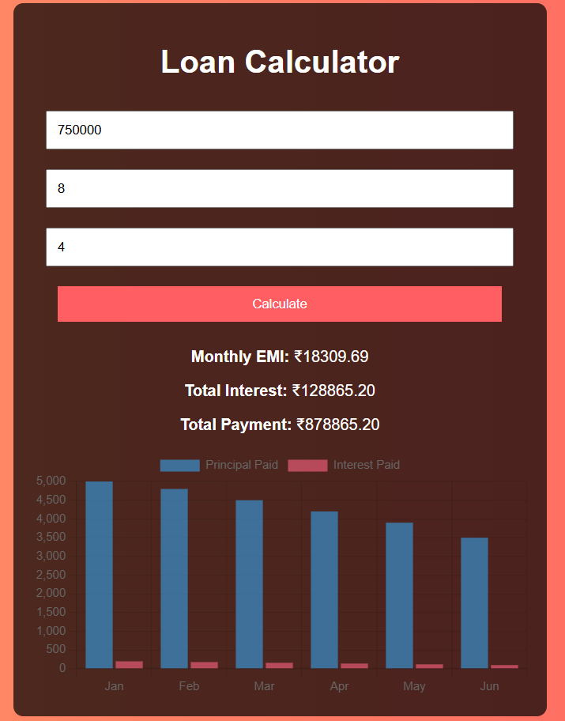

# 💸 Expense Tracker Web App

An interactive, client-side **Expense Tracker** built using **HTML, CSS, JavaScript**, and **Chart.js**, designed to help users log, categorize, and visualize their daily expenses — with full **localStorage persistence**.

---

## ✨ Features

- 📝 Add expenses with a title, amount, and category
- 💾 **Auto-saves to localStorage** — persists even after closing the browser
- 📊 Dynamic pie chart updates using **Chart.js**
- 🗃️ Filter expenses: All, This Week, This Month
- ❌ Delete individual entries easily
- 🎨 Clean UI with dark mode gradient and responsive design

---

## 🧠 Technologies Used

| Tech         | Purpose                        |
|--------------|--------------------------------|
| HTML/CSS     | Layout and Styling             |
| JavaScript   | Logic, Filtering, localStorage |
| Chart.js     | Visualizing category spending  |

---